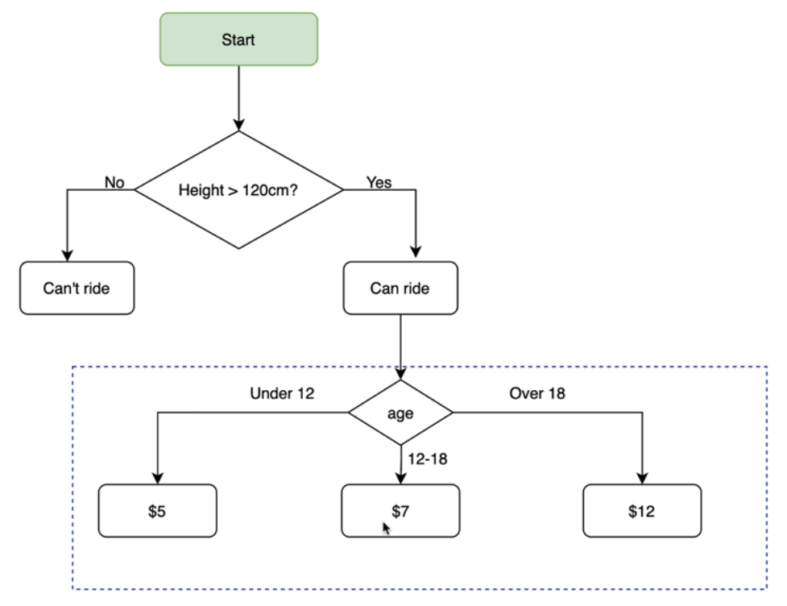
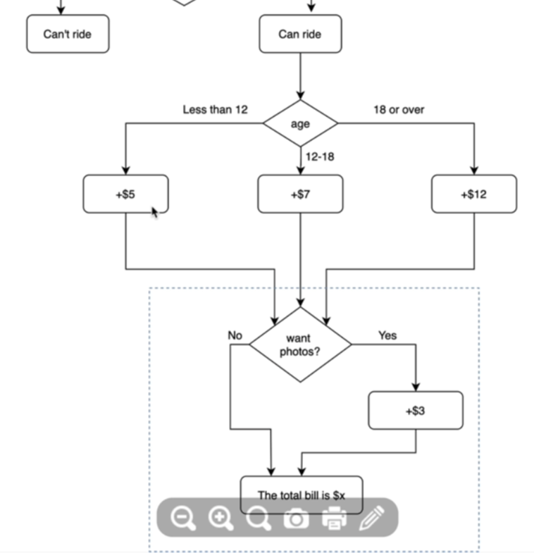

# Day 3 
# Goals: Conditional Statements, Logical Operators, Code Blocks and Scope


# Day 3 Goals: what we will make by the end of the day 
- Treasure Island Text RPG Game


# Get Access to the to the Monthly App Brewery Newsletter
https://londonappbrewery.com/sendy/subscription?f=m7Xj2bDOCQnlJ27yezLEAtJi1mhUIxOaJcJGZYMLLX6wx5MZd0b2FunBI8dOomNt
- I signed up 


# Control Flow with if/else Conditional Operators 
```
if condition:
    do this
elif: 
    do this
else:
    do this

```

all equality operators 
> 
< 
>=
<= 
== 
!=

# 31. [Interactive Coding Exercise] Odd or Even? Introducing the Modulo 
- write a program that works out whether if a given number is an odd or even number. 
- even numbers can be divided by 2 with no remainder 
- % gives you remainder after a division 
6 % 2 = 3 

number = int(input("Enter a number"))

if(number%2==0): 
    print("even")
else:
    print("odd")


# 32. Nested if statements and elif stateements 
if condition: 
    do this 
else: 
    do this 


- 
if condition: 
    if another condition: 
        do this 
    else: 
        do this 
else: 
    do this 
 

- can do elif 

elif vs if 
if can activate other times 
elif will make sure if one condition is not met other conditions will not be considered


# 33. [Interactive Coding Exercise] BMI 2.0 
- write a program like the previous BMI, however depending on what their BMI is you will also tell them if they are 
    - under 18.5, they are underweight
    - over 18.5 but below 25, they have a normal weight 
    - over 25 but below 30, they are slightly overweight. 
    - over 30 but below 35, they are obese
    - if you're over 35 your just straight up clinically obese.

height = float(input("Height Please"))

weight = int(input("Weight Please"))

bmi = weight / height ** 2 

print(bmi)
if bmi < 18.5: 
    print("Underweight")
elif bmi < 25: 
    print("Normal Weight")
elif bmi < 30
    print("Slightly Overweight")
elif bmi < 35:
    print("Obese")
else: 
    print("Clinically Obese")
    

# 34. [Interactive Coding Exercise ] Leap Year 

- write a program to figure out if the given year is a leap year. A normal year has 365 days, whereas a leap year has 366 with an extra day in February.

- Conditions for the Year to be a leap year 
    - on every year that is divisible by 4 with no remainder 
    - except every year that is evenly divisible by 100 with no remainder
    - unless the year is also divisible by 400 with no remainder


year = input("Check year for leap year")

if(year % 4 == 0 ):
    if(year % 100 == 0):
        if(year % 400 == 0):
            print(f"{year} is leap year")
        else:
            print(f"{year} is not a leap year")
    

else:
    print(f"{year} is not a leap year")

# 35. Multiple If Statements in Succession 
if/elif/else 

if condition1:
    do A
elif condition2: 
    do B
else: 
    do C

vs. 


if condition1:
    do A
if condition2: 
    do B
if condition3:


Flow Chart




code
```python
print("Rollercoaster Ride Price Kiosk")
height = int(input("What is your height in cm?"))
bill = 0

if(height<120):
    print("Too short to ride")
else:
    age = int(input("What is your age?"))
    if(age<12):
        bill+=5
    elif(age<18):
        bill+=7
    else:
        bill+=12
    photo = input("Do you want photo, 'Yes' or 'No'")
    if(input='Yes'):
        bill+=3
    print(f"The total bill is {bill}")

```


# 36. [Interactive Coding Exercise] Pizza Order Practice 

- Congratulations, you got a job at Python Pizza! You have to build an automatic pizza order program 
- Based on a user's order, work on their final bill. 
- Small pizza(S): $15 
- Medium Pizza(M): $20
- Large Pizza(L): $25 
Add pepperoni for small pizza(Y or N): +$2
Add pepperoni for medium or large pizza(Y or N): +$3
Add extra cheese for any size pizza(Y or N): +$1

```Python
print("Porky's Pizza Palace")
size = input("What size pizza do you want? S,M,L")
add_pepperoni = input("Do you want pepperoni")
extra_cheese = input("Do you want extra cheese") 
# Write code below this 
price = 0
if(size == 'S'):
    price += 15
elif(size == 'M'):
    price += 20
else: 
    price += 25

if(add_pepperoni == 'Y'):
    if(size == 'S'):
        price += 2
    else:
        price += 3

if(extra_cheese == 'Y')
    price += 1

print(f"Final Bill is {price}")
```

# 37. Logical Operators 

if condition1 & condition2 & condition3: 
    do this 
else: 
    do this 

Logical Operators 
1. A and B 
2. C or D 
3. not E 


# 38. Love Calculator 
- you are going to write a program that tests the compatibility between two people
- To work out the love score between two people 
    1. take both people's name and check for the number of times the letters in the word TRUE occur
    2. Then check for the number of times LOVE occurs 
    3. Then combine these numbers to make a 2 digit number 
- for love score less than 10 or greater than 90, the message should be 
    - "Your score is *x*, you go together like coke and mentos 
- for love score between 40 and 50, the message should be:
    - "Your score is *y*, you are alright together." 
- Otherwise, the message is just their score
    - "Your score is *z*." 

```Python
=
name1 = input("Name One:") 
name2 = input("Name Two:")

both = name1 + name2
both = both.lower()
t = both.count("t")
r = both.count("r")
u = both.count("u")
e = both.count("e")

first = t + r + u + e

l = both.count("l")
o = both.count("o")
v = both.count("v")

second = l + o + v + e 

score = int(str(first) + str(second))

if(score < 10) or (score > 90):
    print(f"Your score is {score}, you go together like coke and mentos.")
elif(score >= 40) and (score <= 50):
    print(f"Your score is {score}, you are alright together.")
else: 
    print(f"Your score is {score}.") 
```


# 39. Day 3 Project: Treasure Island 

```
print("
  _______________________________________
 /                                       \
/   _   _   _                 _   _   _   \
|  | |_| |_| |   _   _   _   | |_| |_| |  |
|   \   _   /   | |_| |_| |   \   _   /   |
|    | | | |     \       /     | | | |    |
|    | |_| |______|     |______| |_| |    |
|    |              ___              |    |
|    |  _    _    (     )    _    _  |    |
|    | | |  |_|  (       )  |_|  | | |    |
|    | |_|       |       |       |_| |    |
|   /            |_______|            \   |
|  |___________________________________|  |
\                                         /
 \_______________________________________/
")


/Users/admin/Documents/challenge_python/day3/treasure_island.png


